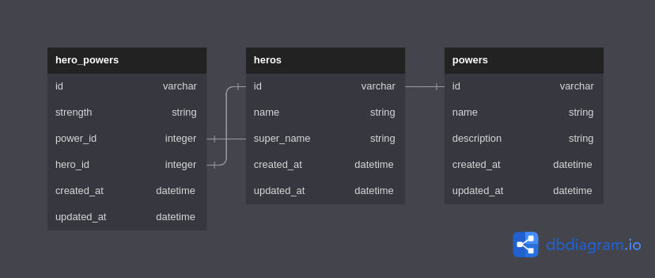

# Superheroes

Tracking heroes and their superpowers.

## Technologies


## Models

- A `Hero` has many `Power`s through `HeroPower`

- A `Power` has many `Hero`s through `HeroPower`

- A `HeroPower` belongs to a `Hero` and belongs to a `Power`
 
    **```Hero --< HeroPower >-- Power```**

## Entity Relationships Diagram
<div></div>

## Validations
### HeroPower Model
- `strength` must be ['Strong','Weak','Average']

### Power Model
- `description` must be present and at least 20 characters long

## Routes
GET /heroes - Get all heroes
GET /heroes/:id  - Get a specific hero
GET /powers - Get all powers
GET /powers/:id - Get a specific power
PATCH /powers/:id - Edit the Power's attributes
POST /hero_powers - Create a new HeroPower ossociating a Hero with a Power.

## Project SetUp Prequisites
[Visual Studio Code](https://code.visualstudio.com/download)  
[Ruby](https://www.ruby-lang.org/en/documentation/installation/)  
[Rails](https://guides.rubyonrails.org/v5.1/getting_started.html)


## Author
Name : Erick Ochieng
Date: 25/03/2023

## License

MIT License

Copyright (c) 2023 Erick Ochieng